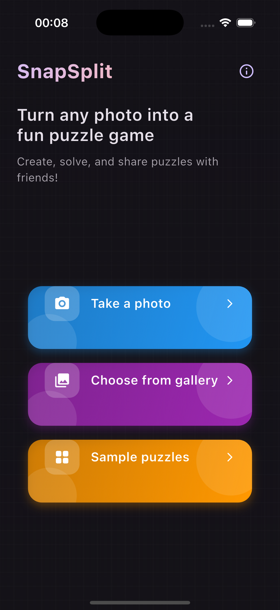
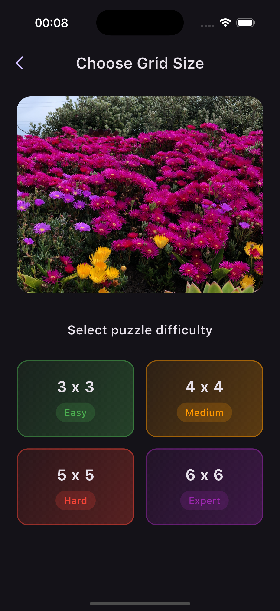
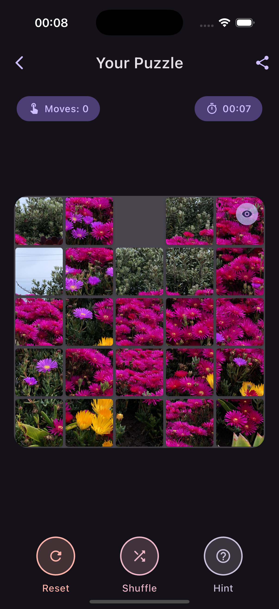

# SnapSplit - Flutter Puzzle Game

A beautiful Flutter app that transforms any photo into an interactive puzzle game.

---

## ✨ Features

- **Image Selection**: Take a photo with your camera or choose one from your gallery
- **Customizable Grid Size**: Choose from 3×3, 4×4, 5×5, or 6×6 grid sizes
- **Modern UI**: Beautiful animations and a sleek interface
- **Game Mechanics**: Track moves and time, get hints, and shuffle the puzzle
- **Share Functionality**: Share puzzles with friends for them to solve

---

## 📸 Screenshots

<p align="center">
  
  
  
</p>


---

## 🚀 Getting Started

### ✅ Prerequisites

- Flutter SDK (latest version)
- Dart SDK (latest version)
- Android Studio / Xcode (for deployment)

---

### 🛠 Installation

1. **Clone this repository:**

   ```bash
   git clone https://github.com/jayawardhanadskp/SnapSplit.git
